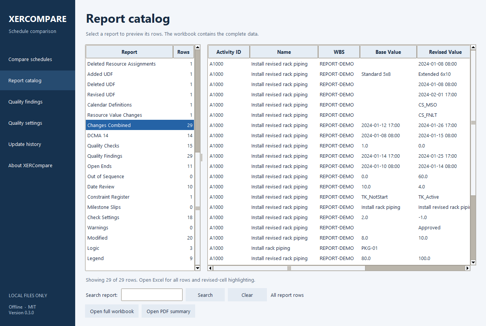

# XERCompare

**Compare two Primavera P6 XER files. Get a detailed Excel workbook and a short PDF summary.**

Free, open-source Windows app. 

## Download and open

### [Download for Windows — v0.3.0 Public Beta](https://github.com/clachance14/XERCompare/releases/download/v0.3.0/XERCompare-Windows.zip)

[PDF instructions](https://github.com/clachance14/XERCompare/releases/download/v0.3.0/XERCompare-Start-Here.pdf)
· [All releases](https://github.com/clachance14/XERCompare/releases)
· [Give feedback](https://github.com/clachance14/XERCompare/issues/new/choose)

1. Download **XERCompare-Windows.zip**.
2. Right-click the ZIP and choose **Extract All**.
3. Open the extracted folder and double-click **XERCompare.exe**.
4. Choose the older XER, revised XER, and an output folder. Click **Compare schedules**.
5. Open the Excel or PDF report, or explore the report catalog inside the app.

Requires **64-bit Windows**. No installer, command line, account, or internet
connection is needed to run the app. Opening the saved reports separately needs
a compatible Excel/PDF viewer; the app's preview works without Excel.

**Try it first:** the ZIP includes synthetic `base.xer` and `revised.xer` files in
**Example files**. Compare those to see 1 added, 1 deleted, 2 modified, and
1 unchanged activity. Open **START HERE.pdf** for the step-by-step guide.

*Actual v0.3.0 app with synthetic example schedules.*

## What it does

- **39 Excel sheets:** activity, progress, date, duration, calendar, constraint,
  float, relationship, resource assignment, and activity UDF changes.
- **Short owner PDF:** change counts, finish movement, milestone slips, logic
  edits, quality checks, and warnings.
- **Quality review:** affected activities, explanations, open/dangling ends,
  constraints, date checks, and out-of-sequence suspects.
- **Your own check settings:** adjust limits and save/load local profiles.
- **Update history:** compare a folder of exports, review their order, and build
  trends, charts, and full comparison reports, with an optional baseline.

Changed revised values are highlighted in Excel, with filters and frozen headers.
Measurements display one decimal place; costs display two. Counts stay whole
numbers and Excel retains the underlying numeric precision. Each desktop run
creates a new dated output folder and preserves previous reports.

## Help improve the beta

[**Report a problem**](https://github.com/clachance14/XERCompare/issues/new?template=bug_report.yml)
· [**Suggest a feature**](https://github.com/clachance14/XERCompare/issues/new?template=feature_request.yml)
· [**Share your experience**](https://github.com/clachance14/XERCompare/issues/new?template=beta_feedback.yml)
· [**Questions and discussion**](https://github.com/clachance14/XERCompare/discussions)

Tell us whether it opened and compared your files successfully, which findings
were useful or confusing, and what would make you use it regularly. For bugs,
include the app version, Windows version, steps, and expected versus actual results.
Submitting feedback on GitHub requires a GitHub account.

**Feedback is public.** Do not attach confidential XERs, project reports, or
identifying screenshots. Use the included examples or a small synthetic case;
remove client names, paths, and other private details from screenshots and errors.
The app does not send feedback or upload files automatically.

## Know the limits

This is a **public beta**. Please review findings against the source schedules.

- Compares **stored P6 values**; it does not reschedule or recalculate CPM.
- Matches visible Activity IDs. A renamed ID appears as a deletion and addition.
- Reads the first project in each XER; warns when additional projects exist.
- Driving Path Change is an approximation using stored total float at or below
  zero. It does not calculate a connected or longest path.
- DCMA checks 11–14 are N/A with reasons. Custom review indicators are explained
  separately; they are not a schedule certification.
- Tested on the development Windows host with Python removed from PATH and
  bundled dependencies verified. Testing on a separate machine without Python
  remains pending.

See [report definitions](docs/REPORTS.md), [Windows help](docs/WINDOWS.md),
[verification](docs/VERIFICATION.md), and [planned work](docs/PHASES.md).

## Source and contributions

The desktop EXE includes its Python runtime. Developers can also run the Python
source and CLI. See [CONTRIBUTING.md](CONTRIBUTING.md) for local setup, tests, and
Windows build instructions. The application uses its own XER parser and has no
network, telemetry, upload, account, or license-server feature.

Licensed under [MIT](LICENSE). Complete bundled third-party notices are in
**Documents/Licenses.pdf** inside the Windows ZIP and in the app's About screen.

For coding agents: read `HANDOFF.md`, `AGENTS.md`, `docs/PHASES.md`,
`docs/SPEC.md`, then `docs/REPORTS.md`.
